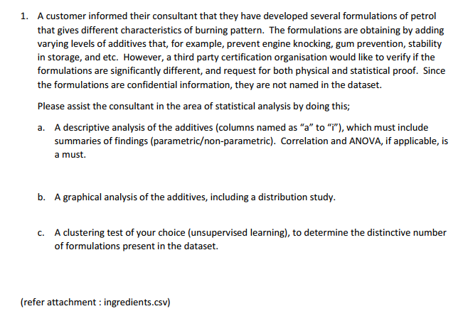
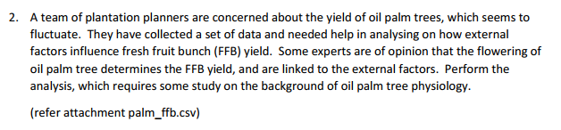
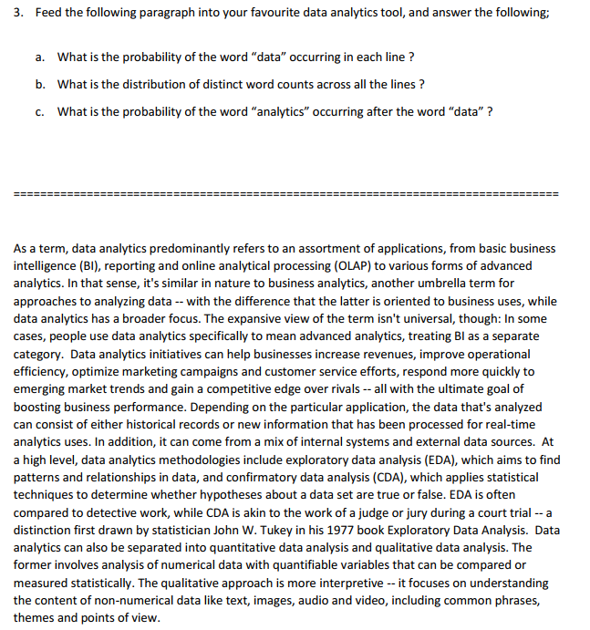

# Note

This solution was developed using the following version of R:

```{r echo=FALSE}
R.version
```


# Libraries

Uncomment this cell to install packages:

```{r}
# install.packages("tidyverse")
# install.packages("moments")
# install.packages("dbscan")
# install.packages("forecast")
# install.packages("lmtest")
# install.packages("tidytext")
```

```{r include=FALSE}
library(tidyverse)
library(moments)
library(dbscan)
library(lubridate)
library(forecast)
library(lmtest)
library(tidytext)
```


# Question 1

## Question



## Solution

Read the ingredients.csv file:

```{r}
df <- read_csv("../data/ingredient.csv", col_types="ddddddddd")

head(df)
```

### Solution to Q1a

Some desriptive statistics:

```{r}
df %>%
  gather(additive, measure) %>%
  group_by(additive) %>%
  summarize(mean = mean(measure), 
            median = median(measure), 
            `standard deviation` = sd(measure), 
            min = min(measure), 
            max=max(measure),
            skewness = skewness(measure),
            kurtosis = kurtosis(measure),
            count = n())
```

One-way ANOVA:

```{r}
df %>%
  gather(additive, measure) %>%
  aov(measure ~ additive, .) %>%
  summary
```

The descriptive statistics show that the measures of each additive are very skewed and have very heavy tails relative to the normal distribution. Additive is stands out the most as the mean value of its measures is very different compared to the other additives. This is consistent with the results from the One-way ANOVA test. 


### Solution to Q1b

Boxplot of each additive:

```{r}
df %>%
  gather(additive, measure) %>%
  ggplot(aes(x=additive, y=measure)) +
  geom_boxplot()
```

The same boxplot but exculding additive "e":

```{r}
df %>%
  select(-e) %>%
  gather(additive, measure) %>%
  ggplot(aes(x=additive, y=measure)) +
  geom_boxplot()
```

Boxplot of just additive "e":

```{r}
df %>%
  select(e) %>%
  gather(additive, measure) %>%
  ggplot(aes(x=additive, y=measure)) +
  geom_boxplot()
```

A density plot of all the additives:

```{r}
df %>%
  gather(additive, measure) %>%
  ggplot(aes(x=measure, y=..scaled.., group=additive, fill=additive)) +
  geom_density(alpha=0.3) +
  ylab("density")
```

The same density plot but excluding additive "e":

```{r}
df %>%
  select(-e) %>%
  gather(additive, measure) %>%
  ggplot(aes(x=measure, y=..scaled.., group=additive, fill=additive)) +
  geom_density(alpha=0.3) +
  ylab("density")
```

The graphical analysis gives the same findings as with the descriptive analysis in the previous answer.

### Solution to Q1c

We will use dbscan to determine the number of clusters.

Find out a suitable value for the `eps` parameter using the k-NN plot for k = dim + 1:

```{r}
df %>%
  gather(additive, measure) %>%
  select(measure) %>%
  kNNdistplot(k=2)
```

We will set the value for `eps` to 0.2.

```{r}
cl <- df %>%
  gather(additive, measure) %>%
  select(measure) %>%
  dbscan(eps=0.20, minPts = 10)

cl
```


Visualize the clusters:

```{r}
df %>%
  gather(additive, measure) %>%
  mutate(cluster = cl$cluster) %>%
  mutate(cluster = factor(cluster)) %>%
  ggplot(aes(x = additive, y = measure, color = cluster, group = cluster)) +
  geom_point() +
  geom_jitter(alpha = 0.3)
```

This clustering technique found 4 distinct clusters (cluster 0 is noise). This is consistent with the graphical analysis in the previous answer.

# Question 2

## Question



## Solution

### Solution to Q2

Read the data:

```{r}
df <- read_csv("../data/palm_ffb.csv", col_types="cdddddddd") %>%
  mutate(Date = dmy(Date))

head(df)
```

Plot the `FFB_Yield` trend:

```{r}
df %>%
  ggplot(aes(x = Date, y = FFB_Yield)) +
  geom_line()
```

Clearly, there is a seasonal component.

Fit an ARIMA with linear regression model:


```{r}
y <- ts(df$FFB_Yield, start = c(2008, 1), end = c(2018, 10), frequency = 12)


# trial and error results in the following set of variables giving the best model in terms of AIC
x <- df %>%
  select(-Date, -FFB_Yield, -HA_Harvested, -SoilMoisture, -Precipitation, -Min_Temp, -Max_Temp) %>%
  as.matrix()

model <- auto.arima(y, xreg = x)
summary(model)
```

Test the model's coefficients for statistical significance:

```{r}
coeftest(model)
```

All coefficients are significant at the 5% level.

Check the residuals for autocorrelation:


```{r}
checkresiduals(model)
```

The ACF plot shows only 1 significant spike at lag 6 but the Ljung-Box test does not lead us to conclude (at the 5% significance level) that the residuals are not independently distributed. Also, the other plots show that the residuals look like white noise. Therefore, we can conclude that the residuals are independent.

**Conclusion**:

Given the provided data, the analysis shows that most of the variation in the FFB yield can be explained by the timeseries itself. FFB yield has a 12 month cycle and it's value at month $n$ is a function of the value at month $n-1$. Accounting for this effect, `Working_days` has a positive effect on FFB yield (increasing FFB yield by 0.02 per additional day) while `Average_Temp` has a negative effect on FFB yield (decreasing FFB yield by 0.07 per additional 1 Celcius) holding all other factors constant.

# Question 3

## Question



## Solution

Read the data:

```{r}
df <- read_lines("../data/q3_paragraph.txt") %>%
  enframe(name="line", value="text")
df
```

Calculate total lines:

```{r}
n_lines = nrow(df)
```


### Solution to Q3a

Calculate probabiliy of the word "data" appearing in a line:

```{r}
prob_data <- df %>%
  mutate(has_data = str_detect(text, "data")) %>%
  mutate(has_data = as.numeric(has_data)) %>%
  pull(has_data) %>%
  mean

```

The probability of the word "data" occuring in each line is:

```{r}
# assuming independence
prob_data^n_lines
```

### Solution to Q3b

```{r}
word_count <- df %>%
  unnest_tokens("word", "text") %>%
  count(word, sort=TRUE) %>%
  rowid_to_column("rank")

word_count %>%
  ggplot(aes(x = rank, y = n)) +
  geom_line() +
  xlab("word rank") +
  ylab("word frequency")
```

The distribution of distinct word counts across all the lines follows a approximately a power law.

### Solution to Q3c

```{r}
# put the paragraph into a single line
para <- df %>%
  unnest_tokens("word", "text") %>%
  group_by("word") %>%
  summarize(text = str_c(word, collapse = " ")) %>%
  select("text")

# check that last word is not data
last_word <- para %>%
  pull(text) %>%
  str_extract("\\b\\w+$")

stopifnot(last_word != "data")

bigrams <- para %>%
  unnest_tokens(bigram, text, token = "ngrams", n = 2)

freq_data_and_analytics <- bigrams %>%
  filter(bigram == "data analytics") %>%
  count %>%
  pull(n)

freq_data <- bigrams %>%
  filter(str_detect(bigram, "^data")) %>%
  count %>%
  pull(n)

```

The probability of the word "analytics" occuring after the word "data" is:

```{r}
freq_data_and_analytics/freq_data
```
